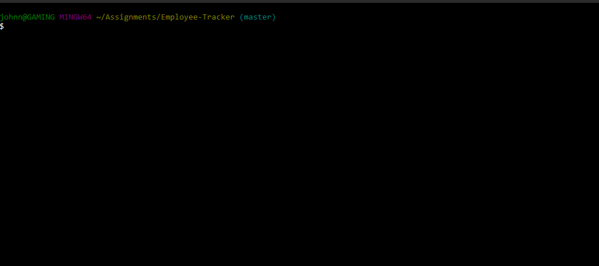

# Employee-Tracker

I will architect and build a solution for managing a company's employees using node, inquirer, and MySQL.

## Table of Content

- [Description](#description)
- [Development](#development)
- [User Story](#user-story)
- [Installation](#installation)
- [Schema](#schema)
- [Dependencies](#dependencies)
- [Tests](#tests)
- [Built With](#built-with)
- [Questions](#questions)
- [Demo](#demo)
- [License](#license)
- [Acknowledgments](#acknowledgments)
- [CopyRight](#copyright)

## Description

We are creating an interface that makes it easy for non-developers to view and interact with information stored in databases. Often these interfaces are known as Content Management Systems.

## Development

This application was built using node.js and adding the required dependencies, as inquirer, mysql, console.clear, console.table and chalk. you can install these via ``npm i (dependency name)``

## User Story

>_As a business owner
I want to be able to view and manage the departments, roles, and employees in my company
So that I can organize and plan my business_<

## Installation

To use this application:

- Clone the GitHub repository at:
- You will to install all the dependencies, see [Dependencies](#dependencies) for the complete list
- Using ```npm install```, install all the dependcies
- Using MySQL or MSSQL database, create the DB using the _schema.sql_ file, you can reciew the database schema on the [Sql schema](#schema.png) file
- Using the _seeds.sql_ file to popluate the DB
- Once you have all the above created, you can edit the _server.js_ file where the password is and add your password to access your local DataBase.
- 
- You can then open a terminal or cmd prompt, navigate to the folder where **_server.js_** is located and type: **_node server.js_**
- You will be presented with an ASCII Art log, which you can also edit at your convenience with your selection of art, and the menu,
- You can navigate the menu using the arrow keys
- Press enter to select the element highlighted
- Follow the prompts for addin employess, roles and departments
- Select **EXIT** in the menu to end the application

### Schema


### Dependencies

- Chalk
- Inquirer
- MYSQL
- Console.table
- console.clear

## Tests

Work in progress. Ran out of time to implement these, I will get back to this project at a later date to finalize these

## Built With

- [VScode](https://code.visualstudio.com/) - The editor of choice
- [Notepad++](https://notepad-plus-plus.org/) - My second editor
- [Gitbash](https://gitforwindows.org/) - What would we do without our bash?

## Questions

1. How can I run the application?  
You just need to follow the instructions on the [installation](#installation) section, where it is explained

2. What if I get an error?  
Ensure that you have install all the dependencies required for this to work. See [Dependencies](#dependencies) section

3. Can I refractor the code in the any of the files file?
Yes, you can modify and refractor the code

4. What If I make a mistake during the input?
You can go to the **_Delete Employee, Role and Department_** and remove the wrong entries, You can also input the **_schema.sql_** file again and it will overwrite the database and you can start from scratch, or you can edit the database manually

## Demo



## License

[MIT License](./LICENSE)

### Authors

- **John Merchan**

## Acknowledgments

To my 2 sons, who give me the power I need to keep going.
Special thanks to Vishal who has is a great teacher and during his time with us during the coruse he showed dedication and enourmous passion teaching us
Stay safe!

***

### CopyRight

Copyright 2020 &copy; John Merchan

:australia:

[Table of Content](#Table-of-Content) --- [Back to Top](#Employee-Tracker) --- [Installation](#Installation)